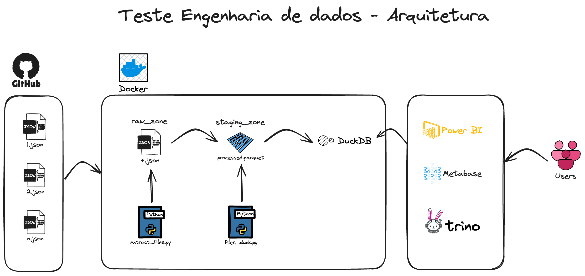
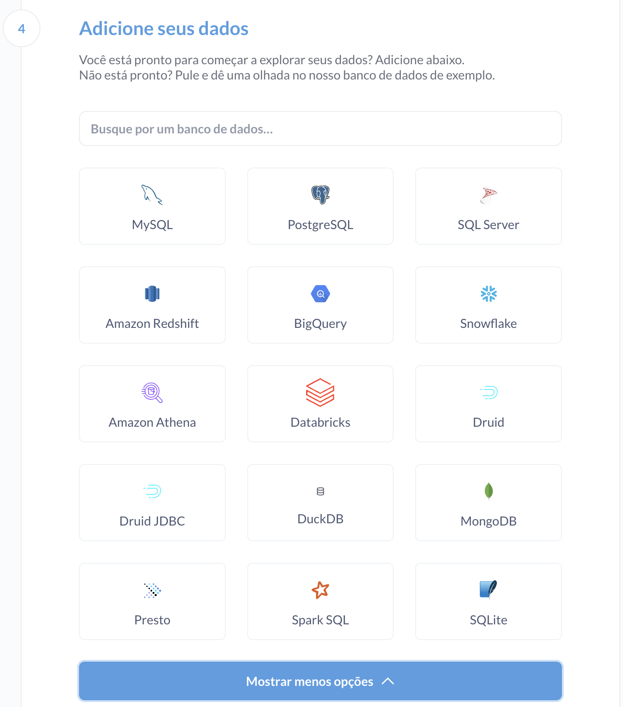
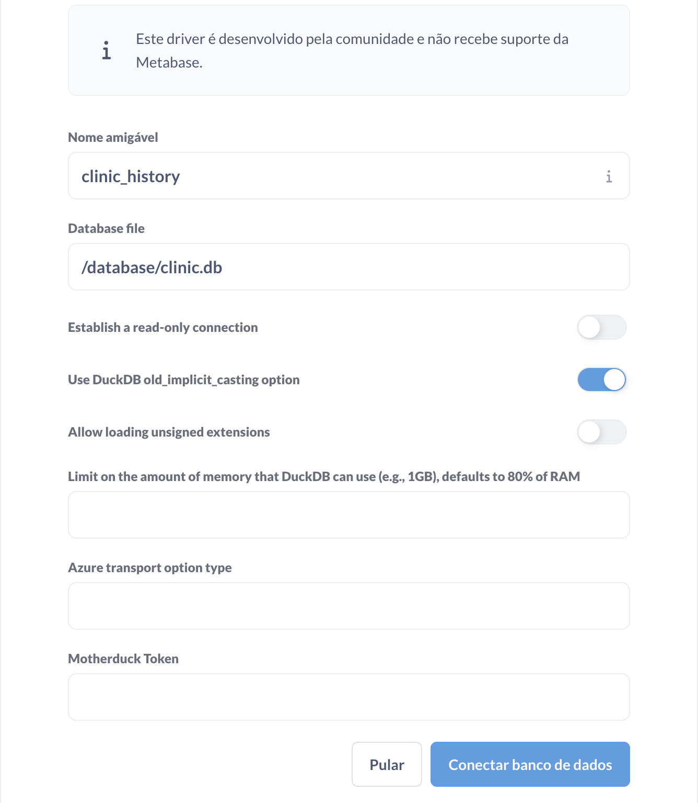
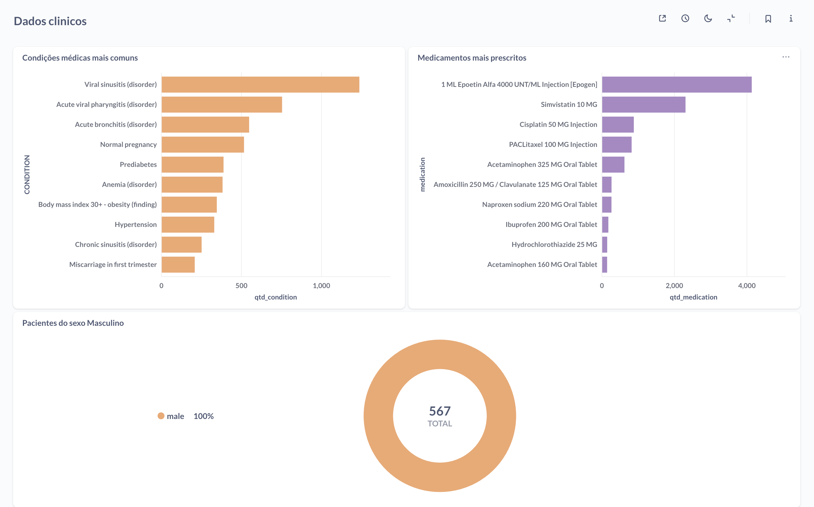

# Teste engenheiro de dados

> Nesse teste é necessário pegar os dados que estão no git, realizar o processamento e logo em seguida
conseguir realizar as análises necessárias.

___



### Realize o clone do repositório e acesse a pasta principal para iniciar o processo.

---

## Docker-compose
Na pasta principal execute o comando abaixo para subir o container do Metabase
```bash
docker-compose up -d --build
```
Obs.: O download dos arquivos pode demorar um pouco.

No terminal, execute:
```bash
# Baixar os arquivos para a camada raw
docker exec -it metabase python /src/files_extract.py

# Processar os dados e salvar na camada staging
docker exec -it metabase python /src/files_duck.py
```

Após finalizado os processos anteriores, acesse [http://localhost:3000](http://localhost:3000) para abrir a página de 
Bem-vindo do Metabase.
- Clique para começar
1. Selecione o idioma de preferência,
1. Preencha o cadastro com informações fictícias,
1. Marque "Ainda não tenho certeza",
1. Será necessário selecionar o banco que foi gerado com o código anterior, para isso expanda a lista de opções e
selecione **DuckDB**

   2. Preencha conforme a imagem abaixo, clique em conectar:
   


---

Pronto, o metabase está disponível para realizar as análises necessárias.

Conseguimos acessar o banco do `DuckDB` via DBeaver, para isso é necessário criar a conexão pesquisando por `DuckDB` e 
apontar para o arquivo `database/clinic.db`

Os arquivos `.sql` respondendo as perguntas do teste estão na pasta `analytics`

### Dash respondendo as perguntas

